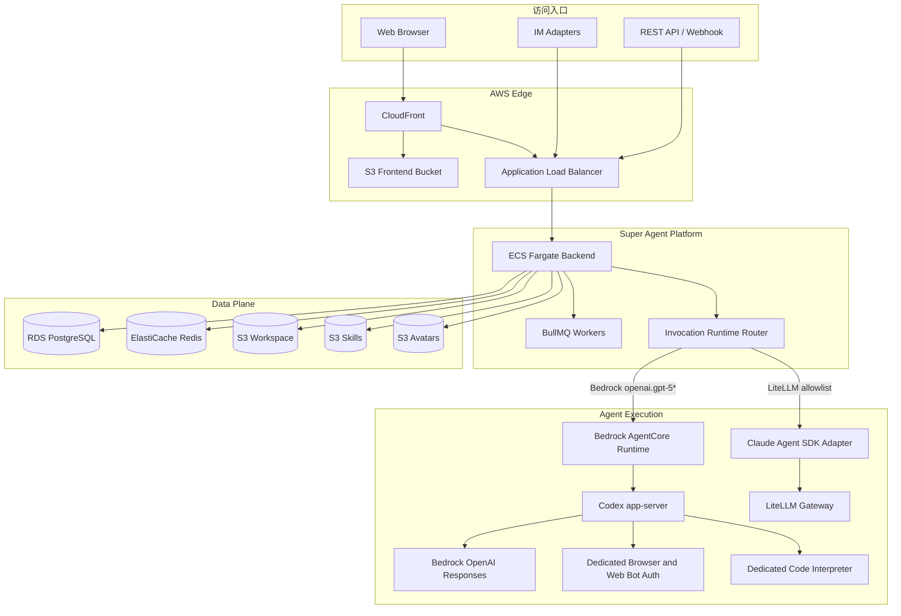
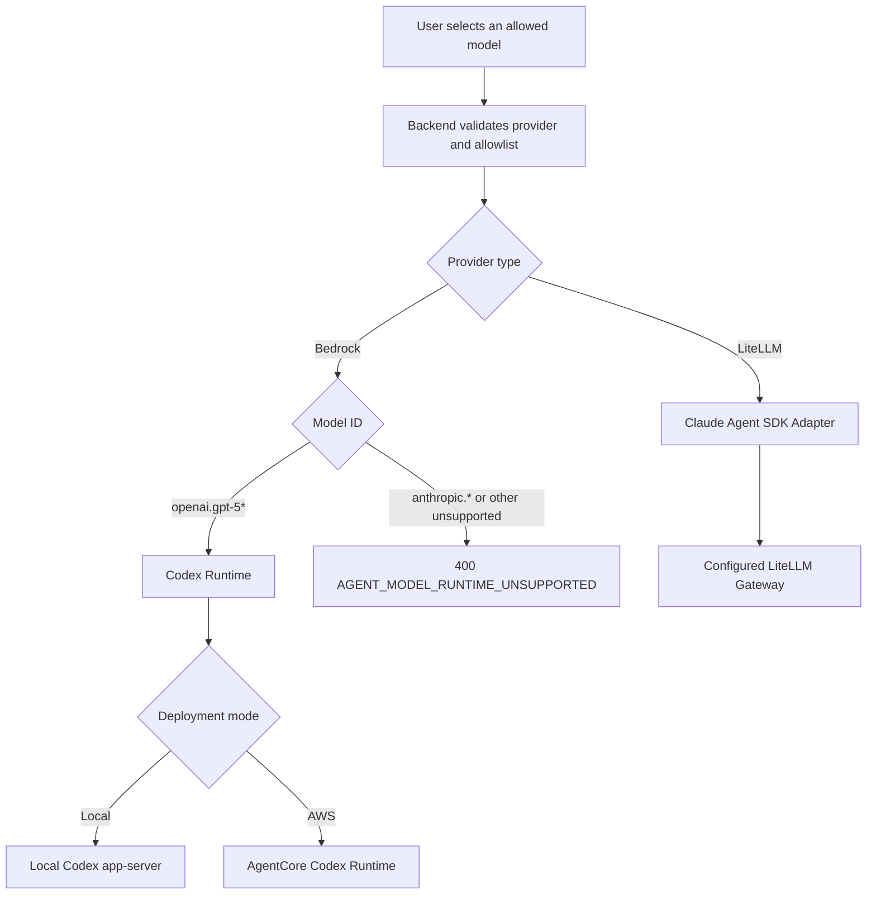
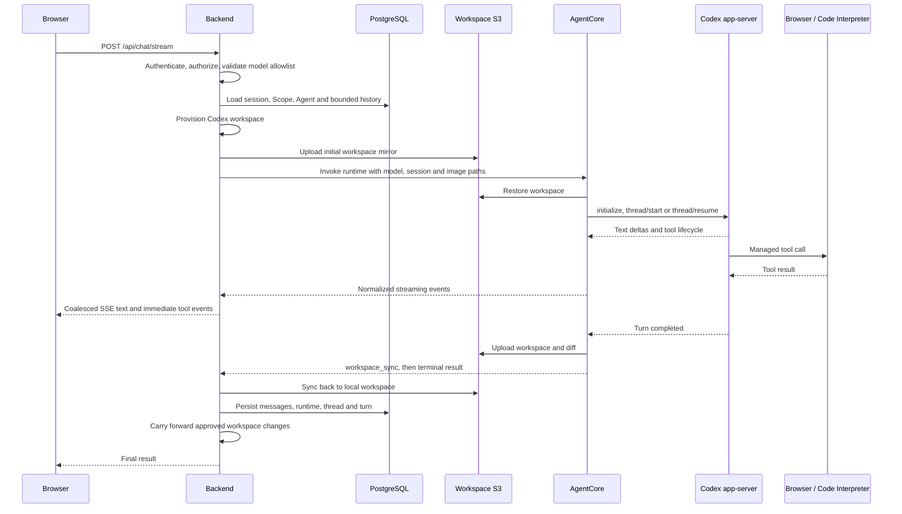
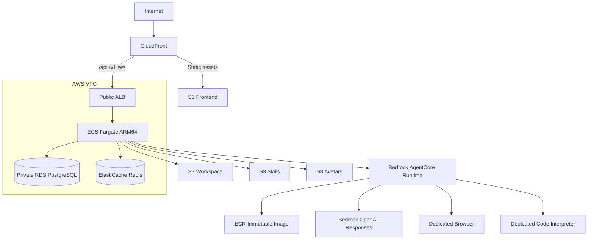

# Super Agent Codex 系统架构

本文描述当前生产架构、模型路由、AgentCore 执行时序、workspace 规范和数据边界。部署操作见 [AWS ECS 部署与运维](../infra/README.md)，产品操作见 [用户使用手册](user-manual.md)。

## 1. 设计目标

当前架构遵循以下原则：

1. **调用级模型路由**：运行时由本次选择的 provider/model 决定，而不是由一个全局开关决定。
2. **Codex 原生工作区**：项目指令、skills、subagents 和配置均使用 Codex canonical layout。
3. **完成即持久化**：只有 workspace 回写与 carry-forward 成功后，用户才会收到完成终态。
4. **失败显式化**：不支持的模型、同步失败、工具失败和 runtime 错误不能静默 fallback。
5. **租户隔离**：组织、Scope、session、workspace、provider thread 和工具资源均有明确边界。
6. **不可变发布**：AgentCore 与 backend 使用 immutable image tag；新 Runtime 通过 create-only 流程发布。

## 2. 系统上下文



## 3. 主要组件

### 3.1 Frontend

React 单页应用通过 CloudFront 或本地 Vite 提供：

- Dashboard、Chat、Workflow、Agents、Tools、Projects 和 Settings
- SSE 对话流、工具时间线、文件树和应用预览
- Workflow WebSocket/事件进度
- 管理员模型 allowlist、成员、权限、API Key 和 feature toggles

开发模式使用同源代理：

```text
/api/*  -> backend REST/SSE
/v1/*   -> backend compatibility APIs
/ws/*   -> backend WebSocket
```

### 3.2 Backend

Fastify backend 是平台控制平面：

- 身份认证、组织与 Scope 授权
- provider/model 解析和 allowlist 校验
- session、消息、provider thread 与执行状态持久化
- workspace provisioning、S3 镜像和 carry-forward
- Workflow、IM、Webhook、定时任务与审计
- SSE 文本合并、工具事件标准化和停止执行

Backend 不把 provider-specific 事件直接暴露给 UI，而是统一为 `session`、`assistant`、`tool_use`、`tool_result`、`result` 和 `error` 等平台事件。

### 3.3 AgentCore Runtime

AgentCore 容器负责：

- 从 S3 恢复 session workspace
- 为 session 创建隔离的 `CODEX_HOME`
- 启动 `codex app-server --stdio`
- 执行 thread start/resume 和 bounded history fallback
- 注入图片、MCP、subagents 和安全配置
- 将 Codex JSONL 事件映射为平台事件
- 中断 turn、生成 diff，并在结束前把 workspace 镜像回 S3

同一 warm container 内的 invocation 会经过隔离与串行保护，避免 `/workspace`、认证变量和 provider thread 串线。

### 3.4 Dedicated AgentCore Tools

生产部署为每个 stack 创建并验证：

- 专用 Browser resource
- Browser signing，用于 Web Bot Auth
- 专用 Code Interpreter resource

平台代理会强制覆盖模型提交的 tool identifier，因此模型不能切回共享的 `aws.browser.v1` 或 `aws.codeinterpreter.v1`。

## 4. 模型路由



### 4.1 Bedrock GPT

`openai.gpt-5*` 使用 Codex 的 `amazon-bedrock` provider。生产环境由 AgentCore 执行，本地开发可直接启动 Codex app-server。

### 4.2 LiteLLM

LiteLLM provider 使用 Claude Agent SDK adapter。管理员从 live catalog 中选择允许模型；普通用户只看到 allowlist，不会看到网关的完整模型目录。

### 4.3 不支持的组合

Bedrock `anthropic.*` 不会直接送入 Codex，也不会在失败后自动改用其他模型。需要使用 Claude 模型时，应在 Admin Settings 中配置 LiteLLM provider。

## 5. Chat 请求时序



文本 delta 会在 backend 的 SSE 边界按短时间窗口合并。工具、错误、心跳和终态不会等待文本缓冲，因此 UI 既保持实时性，也不会每个汉字重渲染一次。

停止按钮先调用 backend interrupt，再关闭浏览器 SSE。关闭标签页只会断开客户端，不等同于停止 provider turn。

## 6. Workspace 架构

```text
workspace/
├── AGENTS.md
├── .agents/
│   └── skills/
│       └── <skill-name>/SKILL.md
├── .codex/
│   ├── agents/
│   │   └── <agent-name>.toml
│   ├── config.toml
│   ├── hooks.json
│   └── scope-system-prompt.md
├── .runtime/
│   └── mcp-servers.json
├── memories/
│   └── lessons.md
└── app/
```

`memories/` 仅在存在对应记录时生成；`AGENTS.md` 也只在文件存在时要求读取它。

### 6.1 配置来源

| Workspace 内容 | 平台来源 |
| --- | --- |
| `AGENTS.md` | Scope 指令、workspace 规则和允许的自定义段落 |
| `.agents/skills` | 组织级、Scope 级和 Agent 级 Skills |
| `.codex/agents` | Scope 下可调用的 subagents |
| `.codex/config.toml` | Codex 项目级配置与受信任的 MCP approval policy |
| `.codex/hooks.json` | 平台安全 hook 与允许的自定义 hook |
| `.runtime/mcp-servers.json` | provider-neutral MCP canonical config |
| `memories/lessons.md` | 已存在的 Scope 经验与修正记录 |

### 6.2 Carry-forward

Agent 对配置文件的有效修改可以回写平台：

- Skills
- subagent TOML
- `AGENTS.md` 自定义段落
- Scope system prompt
- MCP 配置
- hooks

平台生成的派生提示不会写回数据库，避免每轮 session 重复累积。组织级同名 Skill 不会被误判为新的 Scope Skill。

## 7. 安全边界

### 7.1 Workspace

- Codex 使用 `workspace-write` sandbox。
- 模型 shell 网络默认关闭。
- 本地图片和文件路径必须位于 workspace 内。
- S3 上传和下载拒绝路径穿越与 symlink escape。
- 平台安全 hook 优先于自定义 hook。

### 7.2 Protocol

- app-server server request 默认 fail closed，后台运行时不会伪造用户审批。
- 审批需求通过平台 Approvals 功能表达。
- 不支持的 model/provider 组合在 turn 开始前失败。
- AgentCore、MCP 和 Workflow 错误不会 fallback 成看似成功的普通文本。

### 7.3 Credentials

- LiteLLM API Key 存放在 credential vault，不通过模型事件回显。
- AWS 生产环境使用 task role 和 Runtime execution role。
- Browser 与 Code Interpreter 使用专用资源标识。
- 日志和 SSE 输出经过 token/credential sanitizer。

## 8. AWS 部署拓扑



### 8.1 CloudFormation 管理

- ECS cluster、service、task roles 和 ALB
- RDS PostgreSQL
- ElastiCache Redis，`maxmemory-policy=noeviction`
- Frontend、workspace、skills 和 avatars S3 buckets
- CloudFront distribution
- CloudWatch log groups

### 8.2 部署脚本管理

- immutable backend image
- backend 与 AgentCore ECR repositories
- create-only AgentCore Runtime
- dedicated Browser and Code Interpreter
- Prisma migration 与 seed one-off ECS tasks
- ECS task definition rollout 与 readiness
- frontend build、S3 sync 与 CloudFront invalidation

部署脚本不会更新或删除已有 AgentCore Runtime。失败后的续跑必须显式提供一个 `READY` Runtime ARN，或使用最新 ECS task 中已经配置的 Runtime。

## 9. 数据与状态所有权

| 状态 | 权威存储 |
| --- | --- |
| 组织、用户、Scope、Agent、Workflow | PostgreSQL |
| Session、消息、provider thread/turn | PostgreSQL |
| 队列、锁、短期执行状态 | Redis |
| Session workspace | S3 workspace bucket |
| Skill artifact | S3 skills bucket |
| Avatar | S3 avatars bucket |
| Frontend build | S3 frontend bucket |
| Runtime image | ECR |
| Runtime logs | CloudWatch Logs |

## 10. 发布与回滚

发布单元包括：

1. CDK 基础设施变更
2. 新 AgentCore immutable image 与新 Runtime
3. backend immutable image
4. migration 和 seed
5. ECS task definition rollout
6. frontend S3/CloudFront 发布

数据库 migration、seed、Runtime READY、ECS readiness 和 CloudFront smoke 均为 fail-closed gate。

旧 Runtime 不会自动删除，因此可通过注册新的 ECS task definition 指回已验证的 Runtime ARN 完成应用层回滚。数据库变更仍应使用向前兼容迁移，不能依赖容器回滚撤销 schema。

## 11. 当前生产硬化边界

当前 ECS 主线已具备私网数据库、S3 公共访问阻断、静态加密、immutable images 和 fail-closed 发布。正式生产环境仍应根据业务等级评估：

- RDS Multi-AZ 与 deletion protection
- Redis 传输加密、静态加密和高可用
- S3 versioning 与跨区域备份
- WAF、CloudFront/ALB 访问日志和长期归档
- shadow、canary、SLO 和回滚演练
