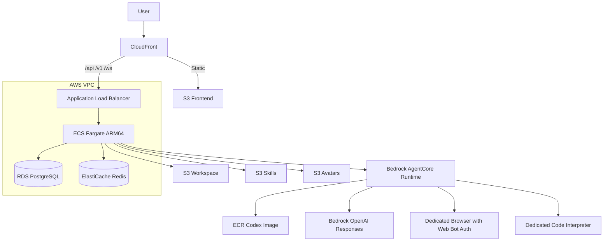

# Super Agent Codex AWS ECS 部署与运维

本文是当前生产架构的部署 runbook。推荐路径是：

```text
CloudFront + S3 Frontend
          |
          +-- ALB -> ECS Fargate Backend
                       |-- RDS PostgreSQL
                       |-- ElastiCache Redis
                       |-- S3 workspace / skills / avatars
                       |-- Bedrock AgentCore Codex Runtime
```

详细组件关系见 [系统架构](../document/architecture.md)。

## 1. 发布原则

`infra/scripts/deploy-full-ecs.sh` 遵循以下规则：

- 默认部署到 `us-east-1`。
- backend 与 AgentCore 镜像使用 immutable tag，不使用 `latest`。
- 正常全量部署创建新的 AgentCore Runtime。
- 不更新或删除已有 AgentCore Runtime。
- 可显式复用一个 `READY` Runtime ARN，但只读取，不修改。
- Prisma migration、seed、Runtime READY、ECS readiness 任一失败都会中止发布。
- JWT secret 存放在 Secrets Manager，增量部署不会重新生成并使用户全部掉线。
- Browser、Web Bot Auth 和 Code Interpreter 使用 stack 专属资源。

## 2. 部署拓扑



## 3. 前置条件

### 3.1 AWS

- AWS CLI v2，已登录目标账号。
- 目标 Region 已启用 Bedrock AgentCore。
- 账号可调用目标 Bedrock OpenAI Responses 模型，例如 `openai.gpt-5.4`。
- 默认 VPC 或 CDK 使用的 VPC 中有可用子网。
- 已完成 CDK bootstrap。
- IAM 身份可管理 CloudFormation、ECS、ECR、RDS、ElastiCache、S3、CloudFront、IAM、Secrets Manager、Logs、Bedrock 和 AgentCore。

检查身份与 Region：

```bash
aws sts get-caller-identity
aws configure get region
```

CDK bootstrap：

```bash
cd infra
npx cdk bootstrap aws://<ACCOUNT_ID>/us-east-1
```

### 3.2 构建环境

- Node.js `>=22`，满足 AgentCore 构建要求。
- npm。
- Docker 与 buildx。
- `jq`、`python3`、`openssl`、`curl`、`git`。
- 推荐 ARM64/Graviton 构建机。

AgentCore 仅接受 `linux/arm64` 镜像。x86 主机可以使用 QEMU/buildx，但速度更慢。

```bash
node --version
docker buildx version
docker buildx inspect --bootstrap
uname -m
```

## 4. 首次部署

从项目根目录执行：

```bash
./infra/scripts/deploy-full-ecs.sh \
  --stack SuperAgentCodex \
  --region us-east-1
```

如需自定义域名：

```bash
./infra/scripts/deploy-full-ecs.sh \
  --stack SuperAgentCodex \
  --region us-east-1 \
  --domain agent.example.com \
  --hosted-zone-id Z0123456789EXAMPLE
```

`--domain` 与 `--hosted-zone-id` 必须同时提供。未配置时，CloudFront 会分配默认 HTTPS 域名。

### 4.1 参数

| 参数 | 说明 |
| --- | --- |
| `--stack NAME` | CloudFormation stack 名，默认 `SuperAgentCodex` |
| `--region REGION` | AWS Region，默认 `us-east-1` |
| `--domain DOMAIN` | 可选 CloudFront 自定义域名 |
| `--hosted-zone-id ID` | 自定义域名所在 Route53 Hosted Zone |
| `--agentcore-runtime-name NAME` | 新 Runtime 名称，必须不存在 |
| `--agentcore-image-tag TAG` | 新 AgentCore immutable image tag |
| `--agentcore-runtime-arn ARN` | 显式复用同账号、同区域的 `READY` Runtime |
| `--skip-cdk` | 复用已有 CloudFormation stack |
| `--skip-agentcore` | 复用最新 ECS task 中的 Runtime |
| `--skip-frontend` | 跳过 frontend build、S3 sync 和 CloudFront invalidation |
| `--skip-backend` | 跳过 backend image、migration、seed 和 ECS rollout |

查看实时帮助：

```bash
./infra/scripts/deploy-full-ecs.sh --help
```

## 5. 部署阶段

### Phase 1: CDK Infrastructure

脚本会：

1. 安装并编译 `infra/`。
2. 查询当前 Region 可用的 PostgreSQL 16.x 和 Redis 7.x。
3. `cdk synth`。
4. `cdk deploy --require-approval never`。

主要资源：

- ECS cluster、Fargate service、task roles
- ALB 和 target group
- RDS PostgreSQL
- ElastiCache Redis，`maxmemory-policy=noeviction`
- workspace、skills、avatars、frontend S3 buckets
- CloudFront distribution
- ECR repositories
- CloudWatch log group
- Secrets Manager database secret

### Phase 2: Create-only AgentCore Runtime

脚本调用：

```text
infra/scripts/deploy-codex-agentcore-new.sh
```

它会：

- 创建 stack 专属 ECR repository。
- 构建并推送 ARM64 Codex image。
- 校验镜像架构。
- 创建新的 execution role。
- 调用 `create-agent-runtime`。
- 等待状态变为 `READY`。

这一步没有 update/delete 分支。同名 Runtime 或 image tag 已存在时会失败。

### Phase 2b: Dedicated AgentCore Tools

脚本调用：

```text
infra/scripts/ensure-agentcore-tools.sh
```

它会 create-or-verify：

- `<stack>_browser_webauth`
- `<stack>_code_interpreter`

Browser 必须：

- `networkMode=PUBLIC`
- `browserSigning.enabled=true`
- execution role 仍存在

Code Interpreter 必须：

- `networkMode=PUBLIC`
- execution role 仍存在

AgentCore MCP policy proxy 会锁定这两个 identifier，模型不能改回 AWS 共享默认工具。

### Phase 3: Backend、Migration、Seed、ECS

脚本会：

1. 构建 ARM64 backend image。
2. 推送 immutable ECR tag。
3. 从 Secrets Manager 读取数据库凭据。
4. 在 VPC 内运行一次性 ECS migration task。
5. migration 成功后运行 seed task。
6. 注册新的 task definition。
7. 更新 ECS service。
8. 等待 service stable 和 ALB readiness。

生产镜像包含 `prisma.config.ts`、Prisma CLI、`tsx`、固定 Codex CLI 和 LiteLLM Claude adapter 所需运行时。

首次 seed 创建：

- local admin：`admin@example.com`
- 默认密码：`admin123`
- 默认 provider：Codex Bedrock
- 默认模型与 allowlist：`openai.gpt-5.4`

首次登录后必须修改默认密码。

### Phase 4: Frontend

脚本会：

1. Vite production build。
2. 同步到 frontend S3 bucket。
3. 创建 CloudFront invalidation。
4. 等待 invalidation 完成。
5. 请求公开 URL 进行 smoke check。

## 6. 失败后安全续跑

发布是 fail-closed 的。某一步失败后，不应修改已有 Runtime 或改用 `latest`。

### 6.1 复用本次已经创建的 Runtime

如果 Runtime 已经 `READY`，但 migration、seed 或 ECS rollout 失败：

```bash
./infra/scripts/deploy-full-ecs.sh \
  --stack SuperAgentCodex \
  --region us-east-1 \
  --skip-cdk \
  --agentcore-runtime-arn <READY_RUNTIME_ARN>
```

脚本会校验：

- ARN 属于当前账号。
- ARN 位于当前 Region。
- Runtime 状态为 `READY`。

它不会更新 Runtime。

### 6.2 复用最新 ECS task 的 Runtime

仅更新代码：

```bash
./infra/scripts/deploy-full-ecs.sh \
  --stack SuperAgentCodex \
  --region us-east-1 \
  --skip-cdk \
  --skip-agentcore
```

脚本从最新 task definition 读取 Runtime ARN。

## 7. 增量发布

### 7.1 只更新 Backend

```bash
./infra/scripts/deploy-full-ecs.sh \
  --stack SuperAgentCodex \
  --region us-east-1 \
  --skip-cdk \
  --skip-agentcore \
  --skip-frontend
```

仍会执行 migration 和 seed。

### 7.2 只更新 Frontend

```bash
./infra/scripts/deploy-full-ecs.sh \
  --stack SuperAgentCodex \
  --region us-east-1 \
  --skip-cdk \
  --skip-agentcore \
  --skip-backend
```

### 7.3 新 AgentCore Runtime + Backend

Runtime 代码或容器依赖发生变化时：

```bash
./infra/scripts/deploy-full-ecs.sh \
  --stack SuperAgentCodex \
  --region us-east-1 \
  --skip-cdk \
  --skip-frontend \
  --agentcore-runtime-name SuperAgentCodexCodex<YYYYMMDDHHMMSS> \
  --agentcore-image-tag codex-<release-id>
```

名称与 tag 必须唯一。

### 7.4 只更新 CDK

先查看差异：

```bash
cd infra
npm ci
npm run build
npx cdk diff \
  -c stackName=SuperAgentCodex \
  -c enableCdn=true \
  -c deployTarget=ecs \
  --region us-east-1
```

确认后可运行完整脚本，或手动 `cdk deploy`。手动部署时必须使用与 full 脚本相同的 context，避免误拿 EC2 template 与 ECS stack 比较。

## 8. 部署后验收

### 8.1 CloudFormation

```bash
aws cloudformation describe-stacks \
  --stack-name SuperAgentCodex \
  --region us-east-1 \
  --query 'Stacks[0].StackStatus' \
  --output text
```

预期：

```text
CREATE_COMPLETE
```

或：

```text
UPDATE_COMPLETE
```

### 8.2 Stack Outputs

```bash
aws cloudformation describe-stacks \
  --stack-name SuperAgentCodex \
  --region us-east-1 \
  --query 'Stacks[0].Outputs[*].[OutputKey,OutputValue]' \
  --output table
```

重点检查：

- `CloudFrontDomainName`
- `EcsClusterName`
- `EcsServiceName`
- `DBEndpoint`
- `RedisEndpoint`
- `WorkspaceBucketName`
- `SkillsBucketName`
- `FrontendBucketName`

### 8.3 ECS

```bash
CLUSTER=<EcsClusterName>
SERVICE=<EcsServiceName>

aws ecs describe-services \
  --cluster "$CLUSTER" \
  --services "$SERVICE" \
  --region us-east-1 \
  --query 'services[0].{desired:desiredCount,running:runningCount,status:deployments[0].rolloutState}' \
  --output table
```

预期：

- desired = running
- rolloutState = `COMPLETED`

检查 ALB target：

```bash
aws elbv2 describe-target-health \
  --target-group-arn <TARGET_GROUP_ARN> \
  --region us-east-1
```

### 8.4 RDS

```bash
aws rds describe-db-instances \
  --region us-east-1 \
  --query 'DBInstances[?contains(DBInstanceIdentifier, `superagentcodex`)].{id:DBInstanceIdentifier,status:DBInstanceStatus,engine:Engine,version:EngineVersion,public:PubliclyAccessible,encrypted:StorageEncrypted}' \
  --output table
```

预期：

- status = `available`
- public = `false`
- encrypted = `true`

### 8.5 Redis

```bash
aws elasticache describe-cache-clusters \
  --show-cache-node-info \
  --region us-east-1
```

确认 parameter group 为 `in-sync`，并检查：

```bash
aws elasticache describe-cache-parameters \
  --cache-parameter-group-name <PARAMETER_GROUP> \
  --region us-east-1 \
  --query 'Parameters[?ParameterName==`maxmemory-policy`].[ParameterName,ParameterValue]' \
  --output table
```

预期：

```text
maxmemory-policy | noeviction
```

### 8.6 S3

对四个 bucket 检查：

```bash
aws s3api get-public-access-block --bucket <BUCKET>
aws s3api get-bucket-encryption --bucket <BUCKET>
```

workspace session 应包含 Codex 布局：

```text
AGENTS.md
.agents/
.codex/
.runtime/
```

不应重新生成 `CLAUDE.md` 或 `.claude/`。

### 8.7 AgentCore Runtime

```bash
aws bedrock-agentcore-control get-agent-runtime \
  --agent-runtime-id <RUNTIME_ID> \
  --region us-east-1
```

预期：

```text
status = READY
```

确认 Runtime 指向本次 immutable ECR tag。

### 8.8 Browser 与 Code Interpreter

```bash
./infra/scripts/ensure-agentcore-tools.sh \
  --stack SuperAgentCodex \
  --region us-east-1 \
  --execution-role-arn <RUNTIME_EXECUTION_ROLE_ARN>
```

脚本会输出：

```text
AGENTCORE_BROWSER_IDENTIFIER=...
AGENTCORE_CODE_INTERPRETER_IDENTIFIER=...
```

### 8.9 应用 Smoke

```bash
curl -fsS https://<CLOUDFRONT_DOMAIN>/
```

登录后至少验证：

1. Settings > Models 中 `openai.gpt-5.4` 已允许。
2. 创建一个 session。
3. 让 Agent 写入 proof 文件。
4. 等待唯一 `completed` 终态。
5. 在 workspace S3 中读回 proof。
6. 调用 Browser 和 Code Interpreter。

## 9. 日志与故障排查

### 9.1 Backend Logs

```bash
aws logs tail \
  /super-agent/superagentcodex/ecs-backend \
  --region us-east-1 \
  --follow
```

其他 stack 的日志组规则：

```text
/super-agent/<stack-name-lowercase>/ecs-backend
```

### 9.2 ECS Task 状态

```bash
aws ecs list-tasks \
  --cluster <CLUSTER> \
  --service-name <SERVICE> \
  --region us-east-1

aws ecs describe-tasks \
  --cluster <CLUSTER> \
  --tasks <TASK_ARN> \
  --region us-east-1
```

### 9.3 ECS Exec

```bash
aws ecs execute-command \
  --cluster <CLUSTER> \
  --task <TASK_ARN> \
  --container backend \
  --interactive \
  --command '/bin/sh' \
  --region us-east-1
```

需要本机安装 Session Manager plugin，且 task role/execution role 具有对应 SSM Messages 权限。

### 9.4 Migration 失败

检查 migration task 的 stopped reason 和 CloudWatch stream：

```bash
aws ecs describe-tasks \
  --cluster <CLUSTER> \
  --tasks <MIGRATION_TASK_ARN> \
  --region us-east-1
```

常见检查项：

- 生产镜像中存在 `prisma.config.ts`。
- `DATABASE_URL` 指向私网 RDS endpoint。
- ECS security group 可以访问 RDS 5432。
- Prisma client 与 CLI 版本一致。
- migration SQL 可向前兼容。

migration 失败后不要继续 seed 或 ECS rollout；full 脚本已经按此行为 fail closed。

### 9.5 AgentCore 424/502

检查：

- 镜像是 `linux/arm64`。
- Docker 使用数字用户。
- 容器监听 `0.0.0.0:8080`。
- `/ping` 和 `/invocations` 符合 AgentCore contract。
- execution role 有 Bedrock Responses/Mantle、S3 和工具权限。
- `WORKSPACE_S3_REGION` 与 bucket 实际 Region 一致。

### 9.6 模型调用失败

- Bedrock GPT 必须走 `openai.gpt-5*` Responses model。
- `gpt-oss-*-1:0` 的 Converse/Invoke model ID 不能替代 Codex 使用的 Responses 路径。
- Bedrock Claude 不属于 Codex provider 支持范围。
- Claude 模型应通过 Settings 中允许的 LiteLLM provider 使用。

### 9.7 BullMQ Warning

如果日志出现 Redis eviction policy warning，确认：

```text
maxmemory-policy=noeviction
```

修改 parameter group 后滚动一次 ECS service，让连接重新建立。

## 10. 回滚

### 10.1 Backend

找到上一版 task definition：

```bash
aws ecs list-task-definitions \
  --family-prefix <TASK_FAMILY> \
  --sort DESC \
  --region us-east-1
```

更新 service 指向已验证 revision：

```bash
aws ecs update-service \
  --cluster <CLUSTER> \
  --service <SERVICE> \
  --task-definition <TASK_DEFINITION_ARN> \
  --region us-east-1
```

### 10.2 AgentCore

不要原地 update 失败 Runtime。注册新的 backend task definition，将 `AGENTCORE_RUNTIME_ARN` 指回已验证的 `READY` Runtime。

### 10.3 Database

数据库 migration 应向前兼容。容器回滚不能自动撤销 schema。破坏性 schema 变更必须使用 expand/migrate/contract 发布策略。

## 11. 生产硬化

当前默认模板适合验证和中等规模环境。正式生产上线前应评估：

- RDS Multi-AZ
- RDS deletion protection
- 更长备份保留期与恢复演练
- Redis 传输加密、静态加密和 replication group
- S3 versioning、Object Lock 或跨区域复制
- AWS WAF
- CloudFront 与 ALB access logs
- Secret rotation
- 告警、SLO、canary 和容量压测

这些配置可能触发资源替换，不应在未查看 `cdk diff` 时直接应用到已有生产 stack。

## 12. 资源清理

资源清理是破坏性操作，执行前必须：

1. 导出数据库 snapshot。
2. 备份需要保留的 S3 数据。
3. 记录当前 Runtime、Browser 和 Code Interpreter ID。
4. 确认没有其他 stack 复用资源。

CloudFormation stack：

```bash
cd infra
npx cdk destroy \
  -c stackName=SuperAgentCodex \
  -c enableCdn=true \
  -c deployTarget=ecs \
  --region us-east-1
```

AgentCore Runtime、dedicated tools、保留策略 S3 bucket、ECR image 和 IAM role 可能不由 CDK 自动删除。应按资源清单逐项人工确认后清理；不要把自动删除逻辑加入正常部署脚本。

## 13. Legacy EC2 路径

仓库仍保留 `deploy-full.sh` 和 `deploy.sh`，用于旧 EC2 安装或迁移参考。当前 Codex/AgentCore 验收、dedicated tools、immutable Runtime 和 fail-closed migration 的权威路径是 `deploy-full-ecs.sh`。

新环境不要从 EC2 文档开始；如必须维护旧环境，应先对照 [迁移规范](../codex-sdk-migration/MIGRATION_SPEC.md) 审计功能差异。
